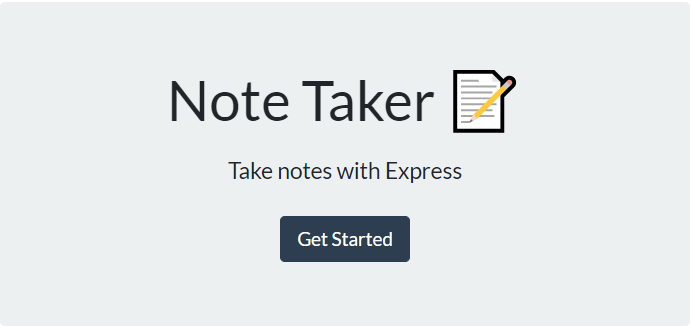
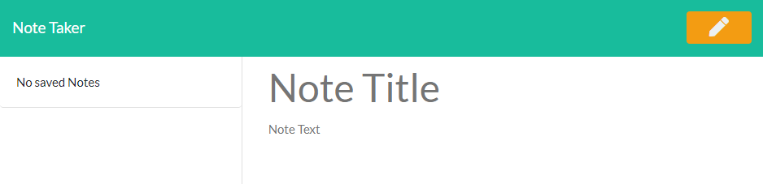
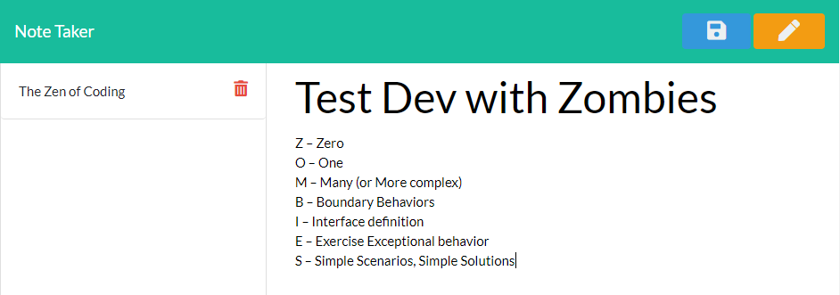
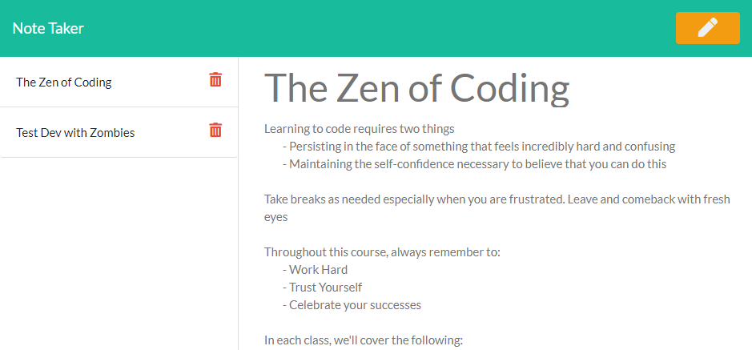

# Note Taker

[Deployed Site](https://tranquil-atoll-93014.herokuapp.com/)

 

## Description

Note taking application using express.

## Table of Contents

* [Usage](#usage)
* [Contributing](#contributing)
* [Support](#support)
* [License](#license)

## Usage

On the home screen click the get started button to continue to the notes page.

A new note can be added by filling in the Note Title, Note Text field, and clicking the save button at the top right of the page.

Notes can be selected and deleted from the column on the left side of the note page.

## Contributing

No contributions are currently being accepted for this project.

## Support

For support regarding this project please contact me via GitHub

## License

This project is licensed under the MIT License.